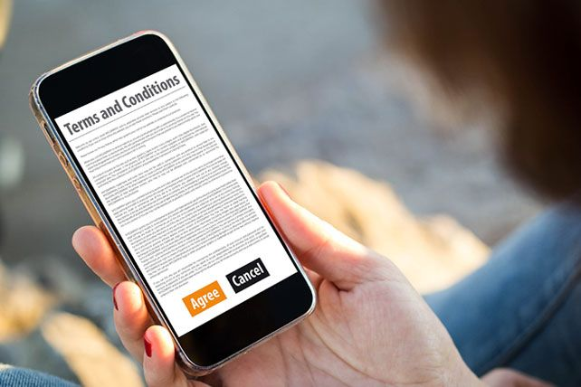

<p align="center">
  
</p>

# ToS Risk Analyzer 

## Basic Details

### Team Name: Matrix

### Team Members
- Member 1: Gayathri N V - Bharata Mata College Autonomous,Thrikkakara
- Member 2: Malavika S - Bharata Mata College Autonomous,Thrikkakara

### Hosted Project Link
https://github.com/Myaaluu/ToS-Risk-Analysis

### Project Description
ToS Risk Analyzer is a web-based Terms of Service (ToS) Risk Analyzer that detects unnecessary and potentially invasive permissions requested by applications. It compares permissions mentioned in a ToS document against what is logically required for the app’s purpose and highlights privacy risks.

### The Problem Statement
Users blindly accept Terms of Service agreements without understanding the permissions they are granting. Many applications request excessive access (camera, contacts, location, etc.) that may not be necessary for their core functionality. There is no simple tool that audits ToS documents and flags privacy risks in a user-friendly way.

### The Solution
ToS Risk Analyzer analyzes ToS text or screenshots using OCR, detects requested permissions, compares them with required permissions based on app category, and identifies high-risk mismatches. It also generates a professional email template users can send to request clarification.

---

## Technical Details

### Technologies/Components Used

**For Software:**
- Languages used: Python, JavaScript, HTML5
- Frameworks used: FastAPI
- Libraries used: Pydantic, Pillow (PIL), pytesseract
- Tools used: VS Code, Git, Uvicorn, Render (Deployment), Tailwind CSS

---

## Features

- Feature 1: Permission Detection Engine – Scans ToS text and detects permissions like camera, location, microphone, contacts, etc.
- Feature 2: App-Purpose Risk Analysis – Matches requested permissions against required permissions for specific app categories.
- Feature 3: High-Risk Permission Identification – Flags permissions that are unnecessary for the app’s core function.
- Feature 4: OCR Support – Extracts text from uploaded ToS screenshots.
- Feature 5: Proof-of-State Verification – Generates SHA256 hash and timestamp for document integrity.
- Feature 6: Auto-Negotiation Email Generator – Creates a professional privacy clarification email.

---

## Implementation

### For Software:

#### Installation
```bash
git clone https://github.com/Myaaluu/ToS-Risk-AnalysisRisk 
cd ToS Risk Analysis
python -m venv venv
source venv/bin/activate      # Mac/Linux
venv\Scripts\activate         # Windows
pip install -r requirements.txt


say hello
